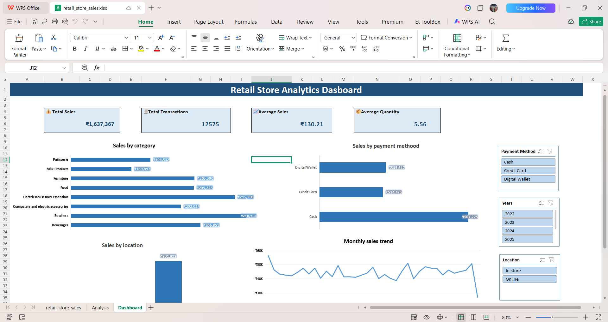

# Retail Store Sales Dashboard (Excel)

# Project Overview

This project is an interactive Retail Store Sales Dashboard built in Microsoft Excel. The dashboard helps analyze sales performance and provides business insights using Pivot Tables, Pivot Charts, KPI Cards and Slicers.

The goal of this project was to transform raw retail sales data into an interactive dashboard that supports better business decision-making.

# Business Problem

The retail business wanted answers to the following questions:

- Which product category generates the highest sales?
- Which payment method is used the most?
- Which location performs better (Online vs In-store)?
- How do monthly sales change over time?
- What are the overall business KPIs such as Total Sales, Total Transactions, Average Sales and Average Quantity?

# Tools & Features Used

- Microsoft Excel
- Data Cleaning
- Pivot Tables
- Pivot Charts
- KPI Cards
- Slicers
- Conditional Formatting

---

# Dashboard KPIs

- 💰 Total Sales
- 🧾 Total Transactions
- 📈 Average Sales
- 📦 Average Quantity

# Dashboard Visualizations

- Sales by Category
- Sales by Payment Method
- Sales by Location
- Monthly Sales Trend
- Interactive Slicers (Year, Payment Method, Location)

# Dataset

- Retail Store Sales Dataset (Sample Retail Dataset)
- Around 12,000+ sales transactions
- Includes transaction details, category, quantity, payment method, location and sales amount.

# Data Cleaning

The following cleaning steps were performed before creating the dashboard:

- Checked for missing values
- Filled missing values using appropriate methods
- Removed duplicate records
- Corrected data types
- Standardized category names
- Created Year and Month fields from Transaction Date

# Key Business Insights

- Cash generated the highest sales.
- Online sales were higher than In-store sales.
- Beverages and Butchers were among the top-performing categories.
- Monthly sales remained relatively stable with small fluctuations.
- Interactive slicers allow users to filter the dashboard instantly.

# Dashboard Preview

Dashboard Screenshot

# Files Included

- retail_store_sales.xlsx
- Dashboard.png

# Skills Demonstrated

- Excel Dashboard Development
- Data Cleaning
- Data Analysis
- Business Analysis
- Pivot Tables
- Pivot Charts
- KPI Design
- Interactive Dashboard Creation
